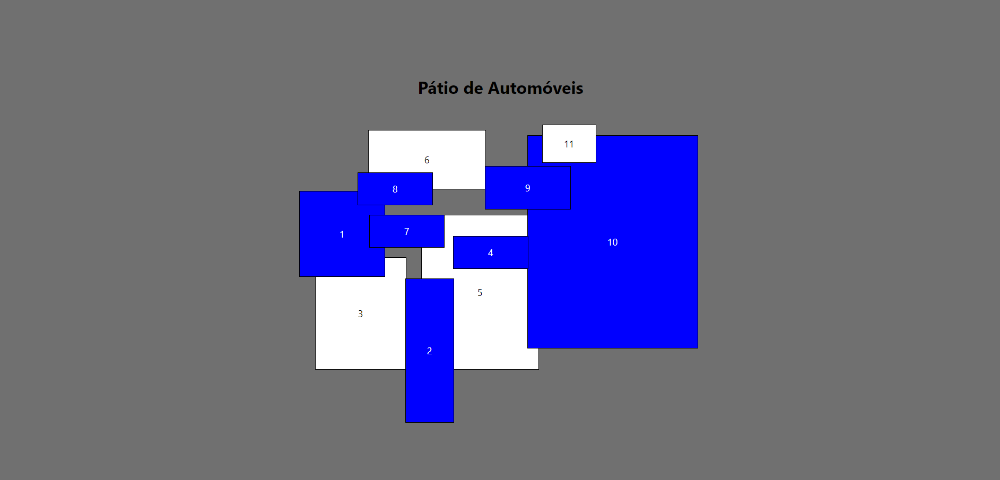
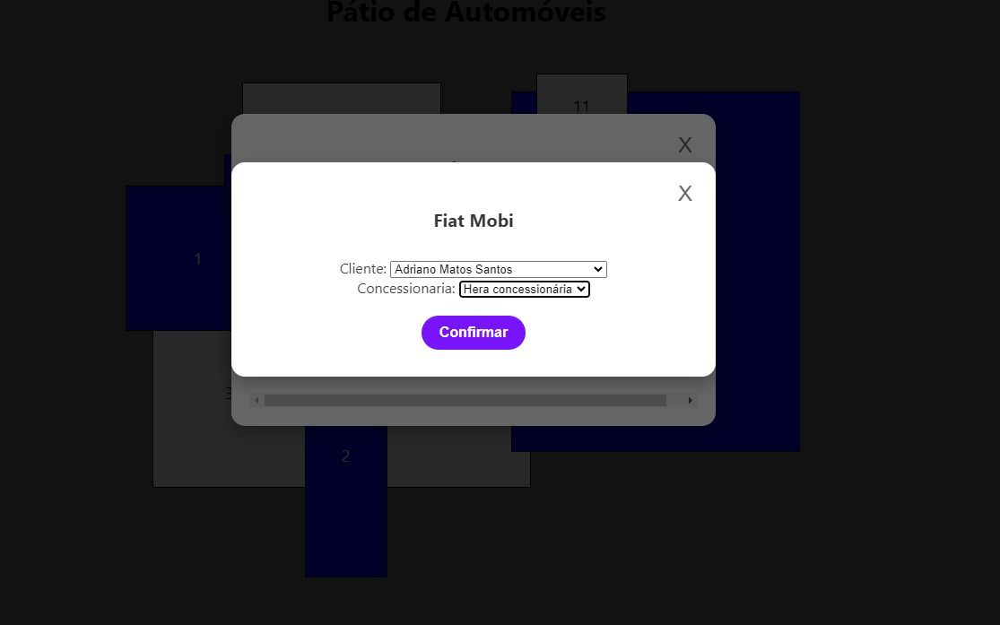

# Sistema de Gestão de Pátio de Automóveis

Este projeto implementa um sistema para gerenciar o pátio de automóveis de uma fábrica. Nele, os funcionários podem visualizar os automóveis alocados em diferentes áreas e realizar a venda de veículos diretamente pelo sistema. O sistema é baseado em **Node.js** com **Prisma** como ORM e utiliza o banco de dados **MySQL**.

## Tecnologias Utilizadas

- **Node.js**: Ambiente de execução de código JavaScript no servidor.
- **Express**: Framework web usado para criar APIs RESTful.
- **Prisma**: ORM que facilita o gerenciamento de dados no banco.
- **MySQL**: Sistema de banco de dados relacional.
- **CORS**: Middleware que permite o compartilhamento de recursos entre origens diferentes.
- **dotenv**: Gerenciador de variáveis de ambiente.

## Estrutura do Banco de Dados

O banco de dados contém cinco modelos principais que representam diferentes entidades do sistema. Abaixo, está a estrutura de cada modelo:

1. **Automóveis**
   - `id`: Identificador único do automóvel.
   - `modelo`: Nome do modelo do automóvel.
   - `preco`: Preço do automóvel.
   - **Relação**: Relacionado com o modelo de alocação.

2. **Clientes**
   - `id`: Identificador único do cliente.
   - `nome`: Nome do cliente.
   - **Relação**: Relacionado com o modelo de vendas.

3. **Concessionárias**
   - `id`: Identificador único da concessionária.
   - `nome`: Nome da concessionária.
   - **Relação**: Relacionada com alocações e vendas.

4. **Alocação**
   - `id`: Identificador único da alocação.
   - `area`: Área de alocação no pátio.
   - `automovelId`: Referência ao automóvel.
   - `concessionariaId`: Referência à concessionária.
   - `quantidade`: Quantidade de veículos alocados na área.
   - **Relação**: Relacionado com vendas.

5. **Vendas**
   - `id`: Identificador único da venda.
   - `clienteId`: Referência ao cliente que realizou a compra.
   - `alocacaoId`: Referência à alocação de onde foi vendida.
   - `concessionariaId`: Referência à concessionária envolvida.
   - `data`: Data da venda.

## Como Configurar o Ambiente de Desenvolvimento

### Pré-requisitos

Antes de começar, você precisa ter instalado os seguintes programas em sua máquina:
- **Node.js**
- **MySQL ou MariaDB**
- **XAMPP** (para gerenciar serviços MySQL localmente, se preferir)
- **Visual Studio Code (VSCode)**

### Passo a Passo da Instalação

1. **Clone o repositório**:  
   Faça o download do código-fonte através do seguinte comando no terminal:

   ```bash
   git clone `link do repositório`
   cd api
   ```

2. **Instale as dependências**:  
   Após entrar na pasta do projeto, instale as bibliotecas necessárias usando o npm:

   ```bash
   npm install
   ```

3. **Configure as variáveis de ambiente**:  
   Crie um arquivo `.env` na raiz do projeto com a seguinte configuração:

   ```
   DATABASE_URL="mysql://root:@localhost:3306/automoveis"
   PORT=3000
   ```

   Substitua o valor `root` e `localhost` conforme a sua configuração do MySQL.

4. **Execute as migrações para o banco de dados**:  
   Para criar as tabelas necessárias no banco de dados, rode o comando de migração do Prisma:

   ```bash
   npx prisma migrate dev --name automoveis inity
   ```

5. **Inserir dados iniciais no banco de dados**:  
   Opcionalmente, você pode preencher o banco de dados com dados iniciais:

   ```bash
   npx prisma db seed
   ```

6. **Iniciar o servidor**:  
   Por fim, inicie o servidor da aplicação:

   ```bash
   node server.js
   ```

   O servidor estará rodando em: [http://localhost:3000](http://localhost:3000)

## Endpoints da API

Aqui estão os principais endpoints disponíveis na API:

### Alocação
- **GET /alocacao**: Retorna todas as alocações onde a quantidade de veículos é maior ou igual a zero.
- **GET /alocacao/area**: Agrupa e retorna as alocações por área no pátio.

### Automóveis
- **GET /automoveis**: Lista todos os automóveis.
- **GET /automoveis/:area**: Retorna os automóveis alocados em uma área específica.

### Clientes
- **GET /clientes**: Retorna todos os clientes cadastrados.

### Concessionárias
- **GET /concessionarias**: Retorna todas as concessionárias.
- **GET /concessionarias/:automovelId**: Retorna concessionárias que têm alocações de um automóvel específico.

### Vendas
- **GET /vendas**: Retorna todas as vendas registradas.
- **POST /vendas**: Cria uma nova venda no sistema.

## Descrição do Frontend

O sistema possui uma interface web que permite a interação com o pátio de automóveis. Abaixo está a estrutura do frontend:

### Estrutura dos Arquivos

- **HTML**: O arquivo `index.html` organiza a interface principal do usuário.
- **JavaScript**: O arquivo `index.js` gerencia as interações com a API e a lógica de exibição, como a visualização de áreas e a abertura de modais.
- **CSS**: O arquivo `style.css` define o layout e o estilo da interface, incluindo as áreas de estacionamento e os botões de ação.

### Funcionalidades

- **Visualização do Pátio**: Os usuários podem ver quais áreas do pátio possuem veículos e o estado de cada uma.
- **Consulta de Veículos**: É possível consultar os veículos disponíveis em cada área.
- **Realização de Vendas**: O sistema permite que o usuário selecione clientes e concessionárias para realizar vendas de veículos.
- **Alertas Informativos**: Informações e alertas sobre o status das áreas de estacionamento são exibidos na interface.

### Como Executar o Frontend

Para visualizar o frontend, abra o arquivo `index.html` no navegador ou utilize a extensão **Live Server** no VSCode.

### Tecnologias Utilizadas no Frontend

- **HTML**
- **CSS**
- **JavaScript**
- **Fetch API** para realizar as chamadas à API backend
- **FreePick** (opcional para imagens de fundo)

### Padrões de Design Utilizados

A interface segue o seguinte padrão de cores e fontes:

- **Fonte**: Segoe UI para todos os textos.
  
- **Cores Utilizadas**:

| RGB           | HEXADECIMAL |
|---------------|-------------|
| 255, 255, 255 | #FFFFFF     |
| 120, 20, 255  | #7814FF     |
| 112, 112, 112 | #707070     |
| 0, 0, 0      | #000000     |

## Exemplos Visuais do Sistema

### Tela Inicial
A tela inicial mostra as áreas do pátio com seus respectivos status e veículos alocados.



### Modal de Venda
O modal de venda permite que o usuário escolha um cliente e uma concessionária para realizar a venda de um automóvel.


### Modal de Confirmação de Venda
Após selecionar os dados, o sistema exibe uma tela de confirmação da venda.


